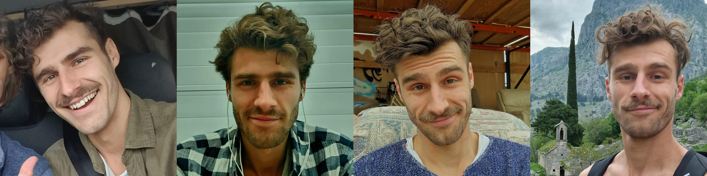
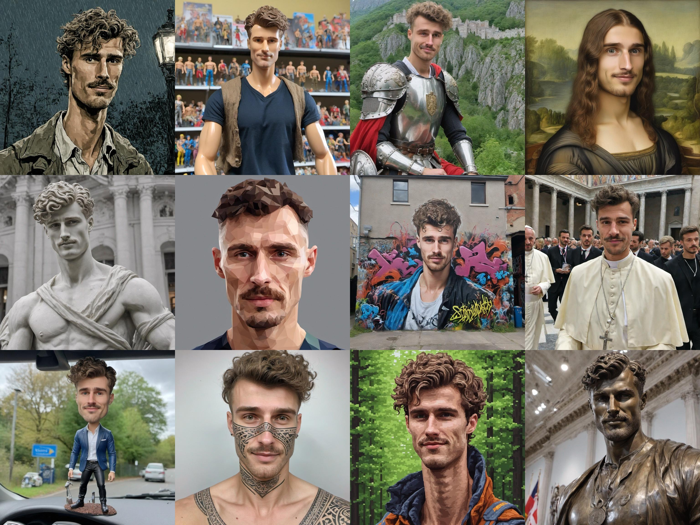

# Trainer

This trainer was developed by the [**Eden** team](https://eden.art/)
It's a highly optimized trainer that can be used for both full finetuning and training LoRa modules on top of Stable Diffusion.
It uses a single training script and loss module that works for both **SDv15** and **SDXL**!

<p align="center">
  <strong>Training images:</strong><br>
  
</p>
<p align="center">
  <strong>Generated imgs with trained LoRa:</strong><br>
  
</p>


The trainer supports 3 default modes:
- **style**: used for learning the aesthetic style of a collection of images.
- **face**: used for learning a specific face (can be human, character, ...).
- **object**: will learn a specific object or thing featured in the training images.

## Setup

Install all dependencies using 
`pip install -r requirements.txt`
then you can simply run:
`python main.py -c training_args.json` 
to start a training job.

Adjust the arguments inside `training_args.json` to setup a custom training job.

--- 

You can also run this through Replicate using cog (~docker image):
1. Install Replicate 'cog':

```
sudo curl -o /usr/local/bin/cog -L "https://github.com/replicate/cog/releases/latest/download/cog_$(uname -s)_$(uname -m)"
sudo chmod +x /usr/local/bin/cog
```

2. Build the image with `sudo cog build`
3. Run a training run with `sudo sh cog_test_train.sh`

## Automatic Checkpoint Evaluation

This script uses CLIP img/txt similarity scores to evaluate how good the LoRa is vs how overfit.
Download the aesthetic predictor model checkpoint first from google drive. This should give you a file named: `aesthetic_score_best_model.pth` (99.2 MB)

```bash
gdown 1thEIlXVc8lkULVUBY9Ab45tsOERxkjxns
```

Once the model is downloaded, you can run the eval script with the following CLI args:

- `output_folder`: this is where the outputs of the model get saved as jpeg files
- `lora_path`: path to your LoRA checkpoint (make sure you edit `path_to_your_model_checkpoints` to point to the correct folder. It generally ends with something like `checkpoint-600` where `600` was the training step)
- `output_json`: save all scores in this json file
- `config_filename`: config file used for training

```bash
python3 evaluate.py \
--output_folder eval_images \
--lora_path path_to_your_model_checkpoint  \
--output_json eval_results.json \
--config_filename training_args.json
```


## TODO's

Bugs:
- pure textual inversion for SD15 does not seem to work well... (but it works amazingly well for SDXL...) ---> if anyone can figure this one out I'd be forever grateful!

Algo:
- Improve some of the chatgpt functionality:
    - separate the "gpt_description" / "gpt_segmentation" prompt calls and make them run on a subset of prompts in case there's a lot of imgs / prompts (possibly use img_grids for some gpt4-v calls)
    - currently some sub-optimal stuff can happen in preprocess() when there's less than 3 or more than 45 imgs, try to improve this
- Test if timesteps = torch.randint() can be improved: look at sdxl training code! (see https://github.com/huggingface/diffusers/blob/main/examples/advanced_diffusion_training/train_dreambooth_lora_sdxl_advanced.py#L1263, https://arxiv.org/pdf/2206.00364.pdf)
- Fix aspect_ratio bucketing in the dataloader (see https://github.com/kohya-ss/sd-scripts)
- test if textual inversion training can also happen with prodigy_optimizer
- improve data augmentation, eg by adding outpainted, smaller versions of faces / objects

Small, minor tweaks:
- preprocess.py: the imgs are first auto-captioned and then cropped, this is not ideal, swap this around!

Bigger improvements:
- add stronger token regularization (eg CelebBasis spanning basis):
- Add multi-token training
- implement perfusion ideas (key locking with superclass): https://research.nvidia.com/labs/par/Perfusion/
- implement prompt-aligned: https://prompt-aligned.github.io/

Tuning Experiments:
- try-out conditioning noise injection during training to increase robustness
- right now it looks like the diffusion model gets partially "destroyed" in the beginning of training (outputs from steps 100-200 look terrible), 
but it then recovers. Can we avoid this collapse? Is the learning rate too high?
- offset noise
- AB test Dora vs Lora

