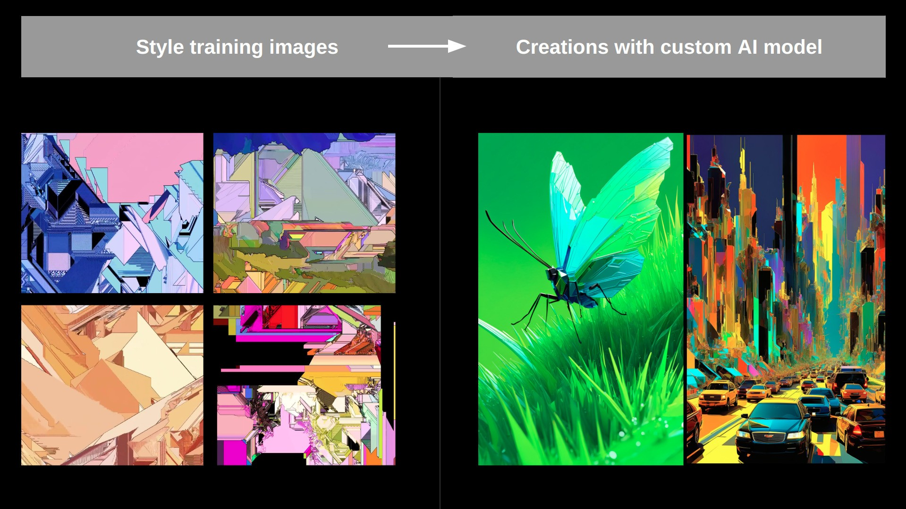

# Trainer

This trainer was developed by the [**Eden** team](https://eden.art/), you can try our hosted version of the trainer in [**our app**](https://app.eden.art/).
It's a highly optimized trainer that can be used for both full finetuning and training LoRa modules on top of Stable Diffusion.
It uses a single training script and loss module that works for both **SDv15** and **SDXL**!

The outputs of this trainer are fully compatible with ComfyUI and AUTO111, see documentation [here](https://docs.eden.art/docs/guides/concepts/#exporting-loras-for-use-in-other-tools).
A full guide on training can be found in [**our docs**](https://docs.eden.art/docs/guides/concepts/#training).

<p align="center">
  <strong>Training images:</strong><br>
  
</p>
<p align="center">
  <strong>Generated imgs with trained LoRa:</strong><br>
  
</p>


### The trainer can be run in 4 different ways:
- [**as a hosted service on our website**](https://app.eden.art/)
- [**as a hosted service through replicate**](https://replicate.com/edenartlab/sdxl-lora-trainer)
- **as a ComfyUI node**
- **as a standalone python script**

### The trainer supports 3 default modes:
- **style**: used for learning the aesthetic style of a collection of images.
- **face**: used for learning a specific face (can be human, character, ...).
- **object**: will learn a specific object or thing featured in the training images.

<p align="center">
  <strong>Style training example:</strong><br>
  
</p>

## Setup

Install all dependencies using 

`pip install -r requirements.txt`

then you can simply run:

`python main.py train_configs/training_args.json` 
to start a training job.

Adjust the arguments inside `training_args.json` to setup a custom training job.

--- 

You can also run this through Replicate using cog (~docker image):
1. Install Replicate 'cog':

```
sudo curl -o /usr/local/bin/cog -L "https://github.com/replicate/cog/releases/latest/download/cog_$(uname -s)_$(uname -m)"
sudo chmod +x /usr/local/bin/cog
```

2. Build the image with `cog build`
3. Run a training run with `sh cog_test_train.sh`
4. You can also go into the container with `cog run /bin/bash`


## TODO's

Bugs:
- pure textual inversion for SD15 does not seem to work well... (but it works amazingly well for SDXL...) ---> if anyone can figure this one out I'd be forever grateful!
- Fix aspect_ratio bucketing in the dataloader (see https://github.com/kohya-ss/sd-scripts)

Bigger improvements:
- integrate Flux / SD3
- Add multi-token training
- add stronger token regularization (eg CelebBasis spanning basis)
- implement perfusion ideas (key locking with superclass): https://research.nvidia.com/labs/par/Perfusion/
- implement prompt-aligned: https://prompt-aligned.github.io/

